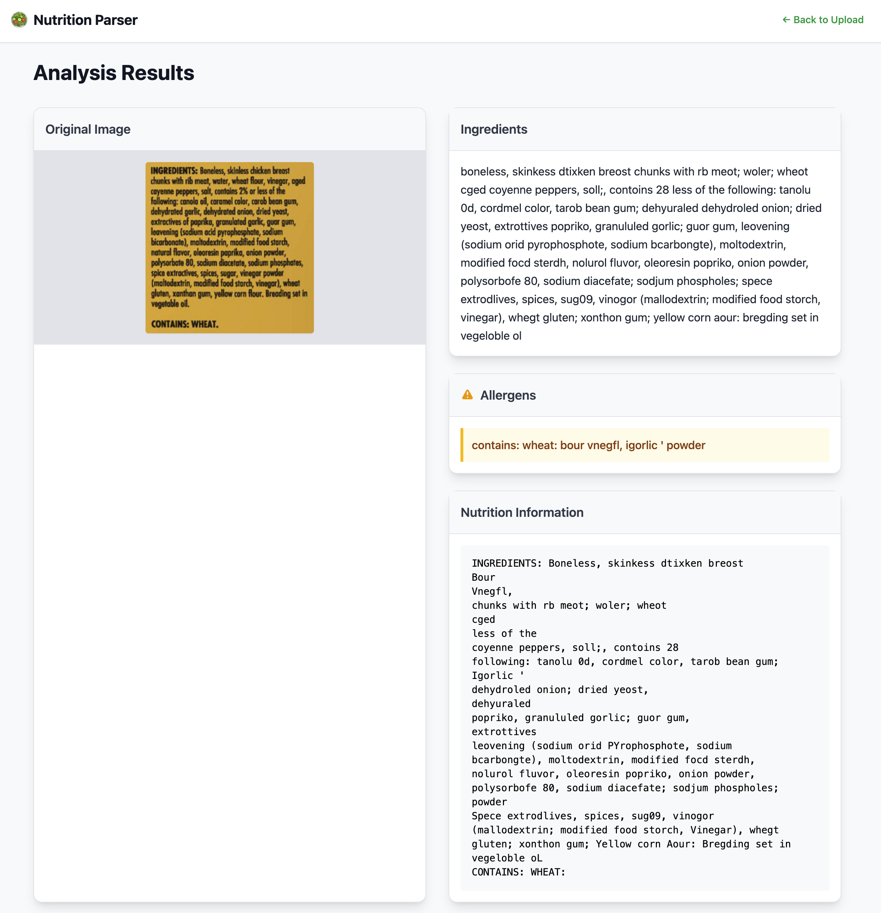

# Nutrition & Ingredients Parser

Small sample application showing the extraction of product information from the ingredient 
and allergen label on a product packaging using 
[Google Cloud Vision AI](https://cloud.google.com/vision). The image needs to be cropped
to the ingredient and allergen part of the product packaging. Extraction of the data from a 
full product back image currently is not supported.

## Setup

A service account with proper rights to access the Cloud Vision API in a Google Cloud Project
is required. Find more about this in the official 
[how to guide](https://cloud.google.com/vision/docs/libraries#client-libraries-install-python).

Place the service account json inside the "ingredients_parser" folder, name it according to
the **config.py** file, the default is **vision_service_account.json**.

## Build & Run
To run the software follow the following steps. There are some test images to use inside
the **tests/static/cropped_ingredients** folder.

### Development Setup
To run the parser locally:

    python -m venv venv
    source venv/bin/activate
    pip install -r requirements.txt
    python main.py
    
After this navigate with your browser to http://localhost:5000/

### Docker
To run it using docker:

    docker build -t ingredients-parser .
    docker run --name ingredients-parser -p 5000:5000 ingredients-parser
    
### Kubernetes
The tool can also deployment to a kubernetes cluster using the 
included **deploy-ingredients-parser.yaml** file.

    kubectl apply -f deploy-ingredients-parser.yaml
    
 

 
