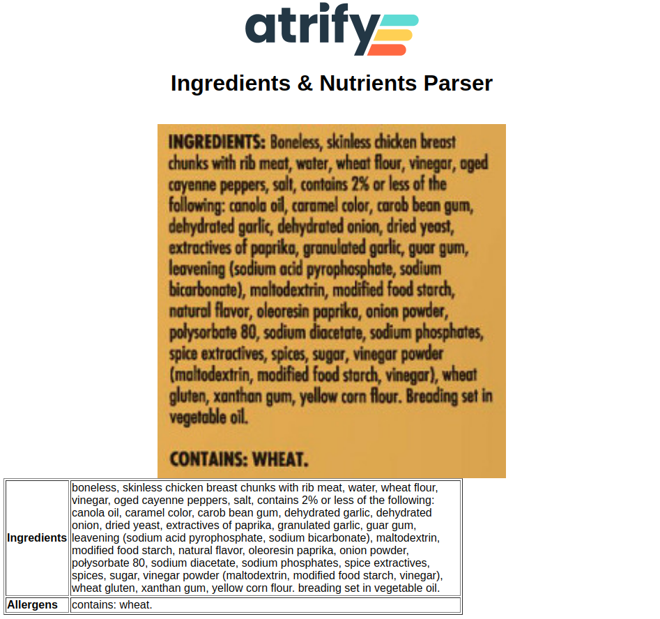

[](https://github.com/irockel/tda/actions/workflows/build.yml)
[](https://github.com/irockel/ingredients_parser/issues?q=is%3Aissue+is%3Aopen+label%3Adependencies)
[](https://libraries.io/github/irockel/ingredients_parser)
[](LICENSE)
# 🥗 Nutrition & Ingredients Parser

A lightweight Flask application that extracts **ingredients**, **allergens**, and **nutrition information** from product packaging images using **[EasyOCR](https://github.com/JaidedAI/EasyOCR)**.



## 🚀 Features

- **Ingredient Extraction**: Automatically identifies and lists ingredients from a cropped image.
- **Allergen Detection**: Specifically highlights potential allergens (e.g., "Contains: Milk", "May contain: Nuts").
- **Nutrition Parsing**: Extracts nutrition facts for easy digitization.
- **OCR Powered**: Utilizes EasyOCR for robust, offline-capable text recognition.
- **Web Interface**: Simple, user-friendly Flask-based UI for uploading and viewing results.

## 🛠️ Setup

### Prerequisites

- Python 3.9+
- [Optional] GPU for faster OCR processing (defaults to CPU)
- AWS CLI configured (if using Rekognition)

### Local Development

1. **Clone the repository**:
   ```bash
   git clone <repository-url>
   cd ingredients_parser
   ```

2. **Create and activate a virtual environment**:
   ```bash
   python -m venv venv
   source venv/bin/activate  # On Windows use `venv\Scripts\activate`
   ```

3. **Install dependencies**:
   ```bash
   pip install -r backend/requirements.txt
   ```

4. **Run the application locally**:
   ```bash
   ./run_local.sh
   ```
   This will start the FastAPI backend on port 8000 and a simple web server for the frontend on port 3000.

5. **Access the UI**:
   Navigate to [http://localhost:3000/](http://localhost:3000/) in your browser.

### Switching OCR Provider

The backend supports both EasyOCR and AWS Rekognition. You can switch between them using the `OCR_TYPE` environment variable.

- **EasyOCR (Default)**: `export OCR_TYPE=easyocr`
- **AWS Rekognition**: `export OCR_TYPE=rekognition`

Note: Using Rekognition requires `boto3` to be configured with valid AWS credentials.

## 📁 Project Structure

- `backend/`: FastAPI application, OCR logic, and providers.
- `frontend/`: Static HTML/JS frontend, ready for S3 deployment.
- `tests/`: Test suites for OCR and parsing logic.

## 🧪 Testing

The project uses `pytest` for testing. To run the tests, use:

```bash
pytest tests/test_ingredients_vision.py
```

Sample images for testing can be found in `tests/static/cropped_ingredients`.

## 📝 Usage Notes

- For best results, ensure the image is **cropped** to the relevant section of the product packaging (ingredients or nutrition table).
- The current version is optimized for English text.

---
*Built with Python, Flask, and EasyOCR.*

 

 
